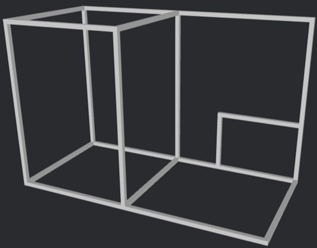
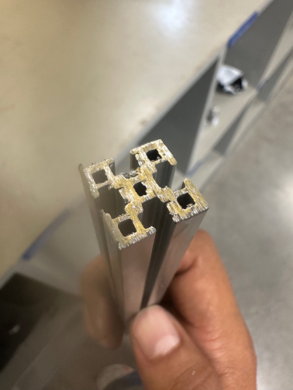
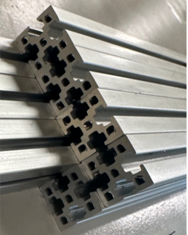
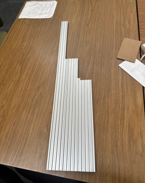
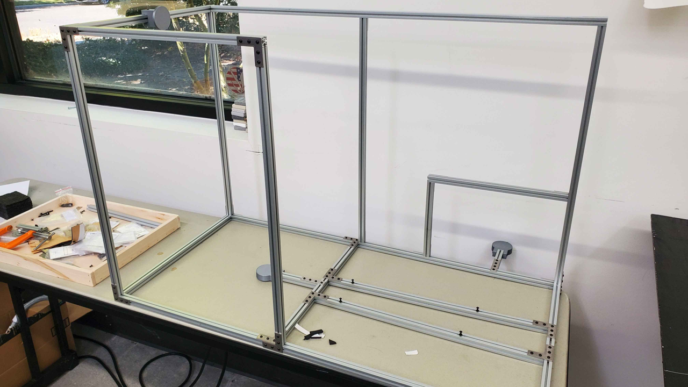
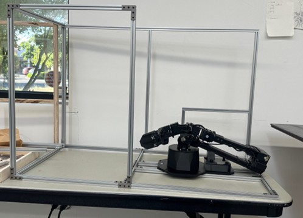
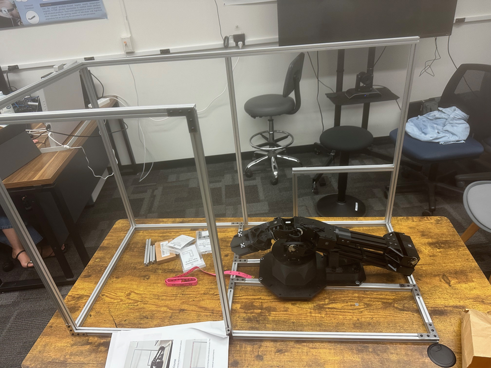

# Robot Arm Obstacle Course
An obstacle course made for a robotic arm manipulator. This obstacle course was part of the NASA MORPHEUS grant investigating ways to improve robotic arm training time and proficiency for space applications. This obstacle course was made for use at NASA's HERA facility at the Johnson Space Center. 

## Tool stack
- SolidWorks
- Mechanical Drawings
- Manufacturing Tools:
  - Mills, Band Saws, Marvel Saw, Table Saw, Track Saw, Belt Sander, Lazer cutter, and Drills

## Visualizations

### 1. Early Obstacle Course CAD
Early version of the obstacle course developed by a Post Doctorate researcher. 

### 2. Manufacturing Process Photos
Image of the cross section of the Aluminum Extrusion beams post rough cut with a Marvel Saw.

Image of the cross section of the Aluminum Extrusion beams post final cut to final size with a Bridgeport Mill.

### 3. First Obstacle Course
Beam for the first obstacle course

First Obstacle Course without the Trossen Arm installed

First Obstacle Course with the Trossen Arm installed

### 4. Second Obstacle Course
Second Obstacle Course beams

Second Obstacle Course 

